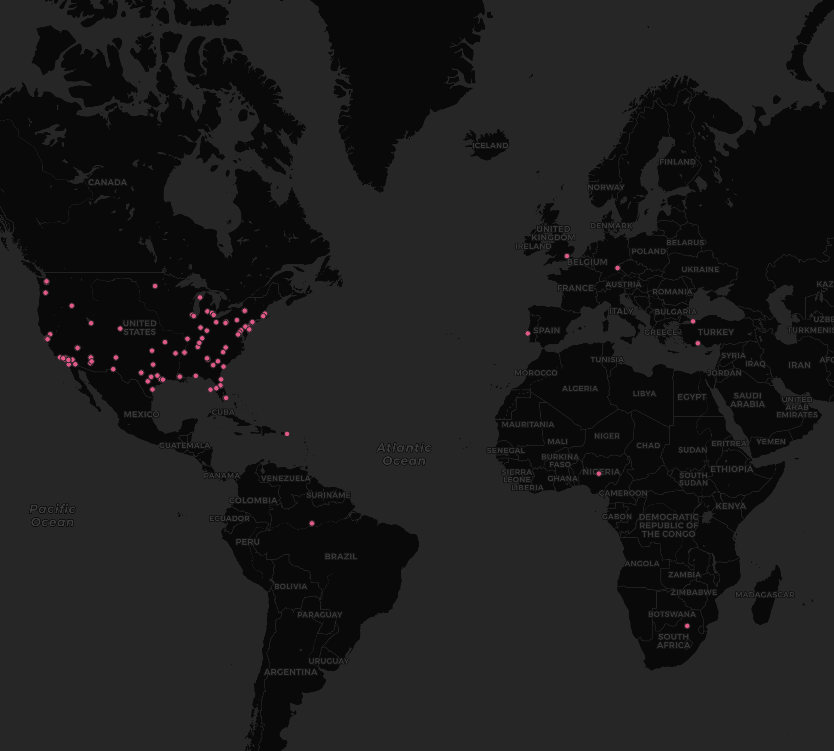

GEOG 458 Lab 2

World Wide Map of Tweets

These points on the map refer to the tweets about the crpto coin called, Dogecoin. Users from all over are using their platforms to raise the worth of the coin using socail media in order to make profits. The map shows tweets from multiple countries who all have something to say about the coins current standing and its future. The United States of America seems to have a lot more dogecoin enthusiasts based off the data points provided. The cluster of tweets in the USA show that there is more attention on dogecoin compared to the rest of countries.

